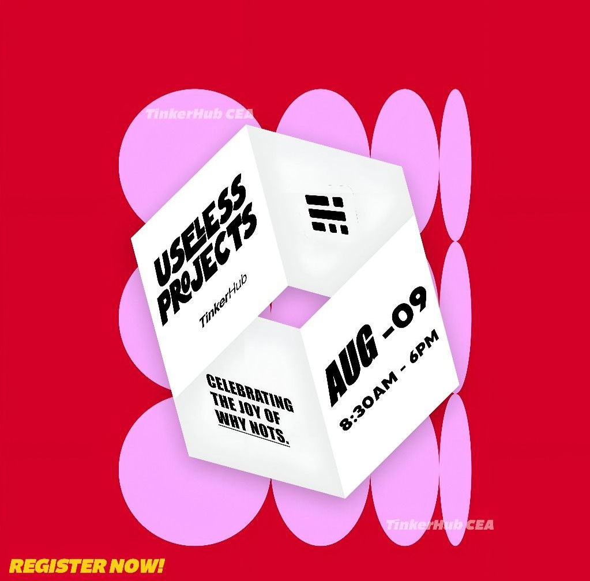

# Molecule_Simulator 🎯

## Basic Details
### Team Name: Ctrl+Alt+Delivers

### Team Members
- Team Lead: Asif Anvar - College of Engineering Adoor
- Member 2: Arun CS - College of Engineering Adoor

### Project Description
Presenting The Hydro-Metric Extrapolator, a whimsical yet useless app that uses your phone's camera, the app "measures" the water in your bottle, but instead of using conventional units, we use distance to measure the content. It calculates the total end-to-end distance of all the water molecules in your drink, giving you a completely impractical, yet technically accurate, value. This project is for anyone who's ever wondered how many lightyears of H2O molecules their drink contains.

### The Problem (that doesn't exist)
How do you estimate the amount of liquid in a bottle (750 ml / 1 L) in the least practical way imaginable?

### The Solution (that nobody asked for)
Measure it in light-years by calculating how far all the water molecules would stretch if lined up end-to-end. Utterly useless. Perfectly accurate.

## Technical Details
### Technologies/Components Used
For Software:
- dart
- Flutter
- Libraries used: .camera (for capturing images using device camera)
                  .video_player (for displaying loading animation)
                  .flutter_launcher_icons (for setting custom app icons)
- [Tools used]:   .Android Studio / VS Code (development)
                  .Flutter SDK
                  .Dart SDK

For Hardware:
-Main components: Android phone or iOS device with working camera
-Specifications: Minimum 2 GB RAM, Android 8.0+ or iOS 13+, rear camera
-Tools required: USB cable (for debugging), computer with Flutter installed

### Implementation
For Software:
# Installation
flutter pub get

# Run
flutter run

### Project Documentation
For Software:

# Screenshots (Add at least 3)

When you first launch the app, the app asks for camera permissions. The user then aligns the camera to the bottle using the bottle_outline overlay and clicks capture.

Then the user moves the blue line to the level of water, and click begin

Loading screen with custom animation

Shows the result:

If the resulting distance is above 1 lightyear, the app uses the length contraction equation.

# Diagrams

*Add caption explaining your workflow*

For Hardware:

# Schematic & Circuit

*Add caption explaining connections*

*Add caption explaining the schematic*

# Build Photos

*List out all components shown*

*Explain the build steps*

*Explain the final build*

### Project Demo
# Video

Click on the image for video
The full working of the app

# Additional Demos
[Add any extra demo materials/links]

## Team Contributions
- [Name 1]: [Specific contributions]
- [Name 2]: [Specific contributions]
- [Name 3]: [Specific contributions]

---
Made with ❤️ at TinkerHub Useless Projects 

# mod

A new Flutter project.

## Getting Started

This project is a starting point for a Flutter application.

A few resources to get you started if this is your first Flutter project:

- [Lab: Write your first Flutter app](https://docs.flutter.dev/get-started/codelab)
- [Cookbook: Useful Flutter samples](https://docs.flutter.dev/cookbook)

For help getting started with Flutter development, view the
[online documentation](https://docs.flutter.dev/), which offers tutorials,
samples, guidance on mobile development, and a full API reference.

